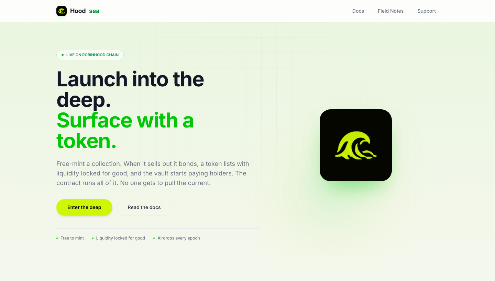
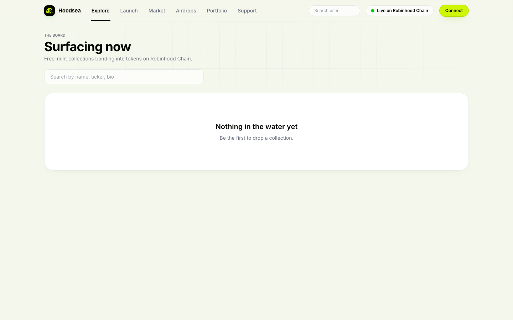
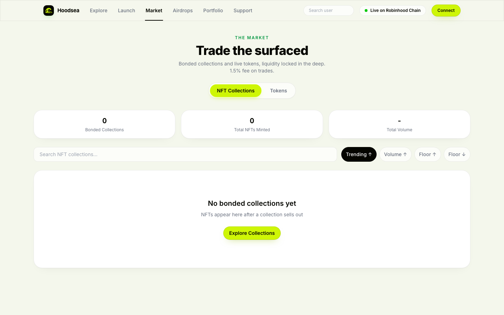
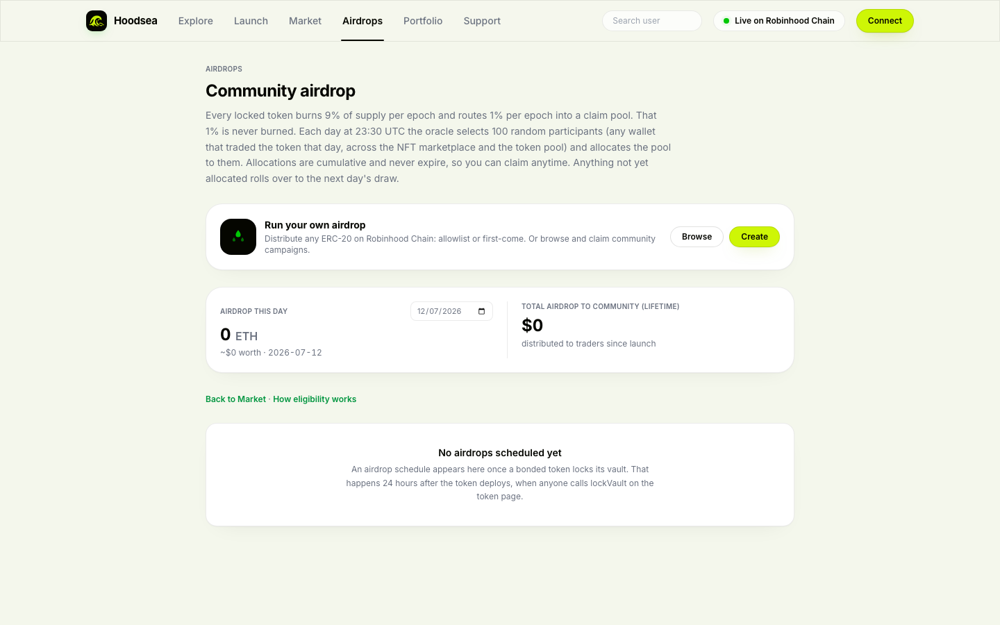

<div align="center">



# Hoodsea

### Launch into the deep. Surface with a token.

NFT to token launchpad on **Robinhood Chain**. Free-mint a collection of 10 to 10,000 NFTs, sell it out, and an ERC-20 token deploys automatically with its liquidity seeded into Uniswap V3 and V4 and locked for good. Every mechanism normally used to rug a launch is removed or hard-coded on-chain.

[](https://docs.robinhood.com/chain/)
[](https://hoodsea.com)
[](https://x.com/hoodsea_)
[](./LICENSE)
[](https://hoodsea.com)

[Website](https://hoodsea.com) · [X / Twitter](https://x.com/hoodsea_) · [Docs](https://hoodsea.com/docs)

</div>

---

## What is Hoodsea

Hoodsea turns a photo collection into a complete on-chain economy in one flow: an NFT drop, then a live token with locked liquidity, then a reward cycle that pays holders and burns supply. Creators launch in minutes; holders get protection that is enforced by contracts, not promised in a Discord.

It is live now on **Robinhood Chain mainnet** (chain id `4663`), with every contract verified on Blockscout.

## The problem we solve

Most launches fail the same handful of ways. Hoodsea closes each one at the contract level:

| Common rug | How Hoodsea prevents it |
|---|---|
| Liquidity rug pulls | Token liquidity seeds a single-sided Uniswap V3 + V4 position and is locked forever. Fees are collectable, the principal can never be pulled — not by the creator, the platform, or anyone. |
| Team dumps in week one | Distribution is fixed in code; half of supply routes to a vault on a hard-coded schedule. |
| Rarity sniping by bots | Rarity is assigned only at sellout, from a block mined after the final mint. The last minter cannot grind for the Mythic. |
| Allowlist bypass and bot floods | Up to four allowlist phases (Team / GTD / FCFS / Public) with on-chain merkle roots. |
| Malicious marketplace approvals | A built-in marketplace and in-app swap mean no external approvals to drain wallets. |
| Mint proceeds vanishing | Proceeds flow on-chain into the bonding pool, not to an EOA. |

## How it works

1. **Launch.** Upload 3 to 6 photos, pick a supply from 10 to 10,000, set a mint price, toggle an optional token, and configure up to four allowlist phases.
2. **Mint.** The collection mints on a bonding curve. Rarity is assigned at sellout and either revealed instantly or hidden behind a mystery photo for 24h or 7d.
3. **Bond.** The final mint triggers the token factory. An ERC-20 (1B supply) deploys and its liquidity seeds a single-sided **Uniswap V3 (1%)** and **V4** pool, locked forever.
4. **Trade.** The built-in NFT marketplace unlocks and the token trades on the pools. NFTs carry EIP-2981 royalties and a `contractURI`, so collections also list on **OpenSea** (which supports Robinhood Chain).
5. **Reward.** Half of supply locks into a vault. Each epoch burns 9% of supply and routes 1% into a claim pool, airdropped to **100 random participants** who traded that epoch. Allocations never expire.

## Key features

- **Creator-set supply.** 10 to 10,000 NFTs per collection, your call.
- **Dual liquidity.** Tokens list on Uniswap V3 (1%) and V4 — readable by bots and screeners everywhere, locked forever. Pool fees split creator / platform / kas / airdrop.
- **OpenSea ready.** ERC-1155 with EIP-2981 royalties + `contractURI`; royalties use the same split as trading fees.
- **Creator-set swap fee.** 1.5% base up to 3.5%, enforced by a Uniswap V4 hook with optional anti-sniper fee decay.
- **Anti-snipe reveals.** Rarities shuffle at sellout; reveal instant or delayed 24h / 7d.
- **Community airdrops.** 100 random traders per epoch, claimable anytime.

## Deployed contracts

Robinhood Chain (`4663`), all verified on [Blockscout](https://robinhoodchain.blockscout.com):

| Contract | Address |
|---|---|
| Launchpad | [`0xa1e9DAB10a4DED224c090c73B09b6658Cc69331b`](https://robinhoodchain.blockscout.com/address/0xa1e9DAB10a4DED224c090c73B09b6658Cc69331b) |
| Token Factory | [`0x6c0d5D2324a12CA5150f99d0afCCF018a4551322`](https://robinhoodchain.blockscout.com/address/0x6c0d5D2324a12CA5150f99d0afCCF018a4551322) |
| NFT Deployer | [`0xA3B4850FA72863d2c3FbB31aD7ebcFa329288389`](https://robinhoodchain.blockscout.com/address/0xA3B4850FA72863d2c3FbB31aD7ebcFa329288389) |
| Fee Hook | [`0x16a8435E0236Ab716FeCA9BCf732929a17C9C0cC`](https://robinhoodchain.blockscout.com/address/0x16a8435E0236Ab716FeCA9BCf732929a17C9C0cC) |
| Vault | [`0x715311f008A1546Ad32E3Eb84942855c8a709e4e`](https://robinhoodchain.blockscout.com/address/0x715311f008A1546Ad32E3Eb84942855c8a709e4e) |
| Airdrop Distributor | [`0x47Bb7C36FFF1170C8BcC238E3089282377552feF`](https://robinhoodchain.blockscout.com/address/0x47Bb7C36FFF1170C8BcC238E3089282377552feF) |
| Swap Router | [`0x2736840beB3295dAB14BaCD78f71FC934108eB4B`](https://robinhoodchain.blockscout.com/address/0x2736840beB3295dAB14BaCD78f71FC934108eB4B) |

## Screenshots

| Landing | Explore |
|---|---|
|  |  |
| **Marketplace** | **Airdrops** |
|  |  |

## Repository structure

| Package | Stack |
|---|---|
| `contracts/` | Solidity 0.8.26 (Hardhat), Uniswap V3 + V4, OpenZeppelin, EIP-2981 |
| `frontend/` | Next.js 14 (App Router), wagmi + viem, Tailwind |
| `backend/` | Oracle + epoch bots (burn, airdrop merkle roots) |
| `profileapi/` | RPC proxy, event indexer, Irys metadata uploads |

## Development

Each package has its own `.env.example` — copy it to `.env` and fill in your own values. Secrets (private keys, `.env`, `.iryskey`, and friends) are never committed.

```bash
# frontend
cd frontend && npm install && npm run dev

# contracts
cd contracts && npm install && npx hardhat test
```

## License

[MIT](./LICENSE)
